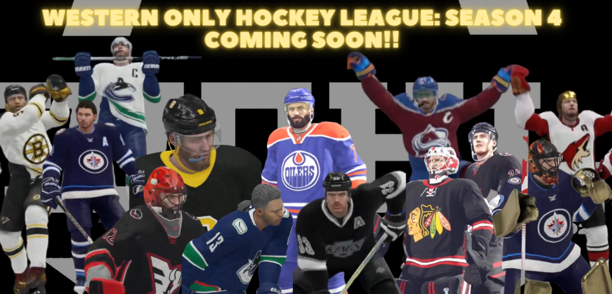

# WOHL Structure & Rules

## [Introduction](intro.md)
A brief introcution into WOHL

## [Code of Conduct](code-of-conduct.md)
Please read our Code of Conduct to understand expected behavior

## [Discord](discord.md)
Information specific to Discord

## [Player](player.md)
A description of player role and responsibilities

## [Management and Officials](management-and-officials.md)
A description of management and officials roles and responsibilities

## [Trades](trades.md)
A detailed survey of everything to do with player trades

## [Transactions](transactions.md)
How transactions like draft, trades and waiver wire are handled during a season

## [League Rules](rules.md)
A description of the league rules

## [Discipline](discipline.md)
A guide to consequences and discipline

## [Season 4 Schedule](season4-schedule.yml)
Season 4 schedule
